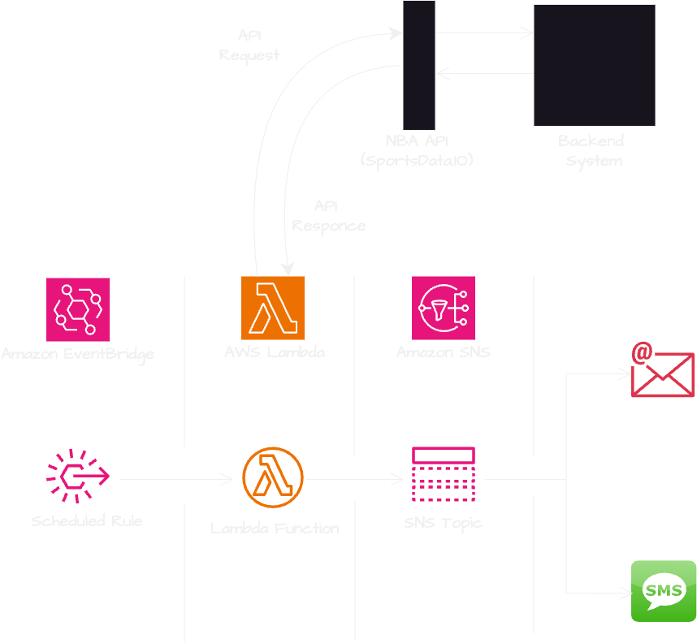

# NBA Game Day Notifications / Sports Alerts System

## **Project Overview**
This project is an alert system that sends real-time NBA game day score notifications to subscribed users via SMS/Email. It leverages **Amazon SNS**, **AWS Lambda and Python**, **Amazon EvenBridge** and **NBA APIs** to provide sports fans with up-to-date game information. The project demonstrates cloud computing principles and efficient notification mechanisms.

---

## **Features**
- Fetches live NBA game scores using an external API.
- Sends formatted score updates to subscribers via SMS/Email using Amazon SNS.
- Scheduled automation for regular updates using Amazon EventBridge.
- Designed with security in mind, following the principle of least privilege for IAM roles.

## **Prerequisites**
- Free account with subscription and API Key at [sportsdata.io](https://sportsdata.io/)
- Personal AWS account with basic understanding of AWS and Python

---

## **Technologies**
- **Cloud Provider**: AWS
- **Core Services**: SNS, Lambda, EventBridge
- **External API**: NBA Game API (SportsData.io)
- **Programming Language**: Python 3.x
- **IAM Security**:
  - Least privilege policies for Lambda, SNS, and EventBridge.

